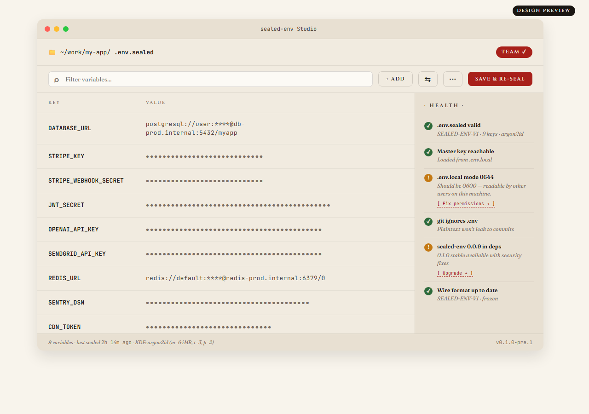

<div align="center">

# sealed-env Studio

**A desktop GUI for [`sealed-env`](https://github.com/davidalmeidac/sealed-env)**
**— for the people who don't live in the terminal.**

[](#status)
[](https://github.com/davidalmeidac/sealed-env)
[](LICENSE)

[Vision](#vision) · [Roadmap](ROADMAP.md) · [Wireframes](docs/design/wireframes.md) · [Visual preview](docs/design/preview/) · [Contribute](CONTRIBUTING.md) · [sealed-env (CLI)](https://github.com/davidalmeidac/sealed-env)

<br/>



<sub>↑ design preview · open <a href="docs/design/preview/index.html">docs/design/preview/index.html</a> in a browser for the interactive version</sub>

</div>

---

> ⚠️ **This repo is in pre-alpha.** Phase 1 (read-only viewer) is
> under active development. The CLI library at
> [github.com/davidalmeidac/sealed-env](https://github.com/davidalmeidac/sealed-env)
> is fully shipped and stable at v0.1.0 — Studio is the companion GUI
> arriving in 0.2.0+ timeframe.

---

## Vision

`sealed-env` is a fast, opinionated CLI for encrypted `.env` files.
It works beautifully in a terminal — but a meaningful chunk of the
people who NEED encrypted secrets aren't terminal-first:

- Backend devs who set up environments for their teammates
- DevOps folks rotating credentials across staging and prod
- Solo founders who deploy with a click and don't want to memorise
  `sealed-env edit .env.sealed`
- New hires getting their `.env.local` set up on day one
- Auditors and managers reviewing what changed without revealing
  values

**Studio is a desktop app that wraps the CLI behind a clean visual
interface.** Same security model, same file format, same
cross-stack guarantees — just discoverable through clicks instead
of memorised flags.

```
       sealed-env CLI                sealed-env Studio
       ───────────────                ─────────────────

   $ sealed-env edit              ┌──────────────────┐
   ↓                              │  📁 my-app       │
   (opens $EDITOR)                │   .env.sealed    │
   ↓                              │   ┌────────────┐ │
   plaintext in tmpfs             │   │ STRIPE_KEY │ │
   ↓                              │   │  sk_live_… │ │
   re-seals on save               │   │ [Edit]     │ │
                                  │   └────────────┘ │
                                  └──────────────────┘
```

## What it'll do (planned)

| Feature | CLI today | Studio (planned) |
|---|---|---|
| **View variables** | `sealed-env get FILE KEY` (one at a time) | Searchable table view |
| **Edit values** | `sealed-env edit` opens $EDITOR | Inline form, auto re-seal on save |
| **Diff envs** | `sealed-env diff a.sealed b.sealed` | Side-by-side coloured diff |
| **TOTP enrollment** | QR in terminal (often misrendered) | Crisp QR in window, scannable |
| **Onboarding new dev** | "Run these 6 commands" | "Drag your master key here" |
| **Health check** | `sealed-env doctor` (CLI 0.1.x) | Live status indicators |
| **Compare prod vs staging** | Manual two-file diff | Persistent multi-env workspace |
| **History** | `git log .env.sealed` (no values) | Visual timeline of changes |

See [docs/design/wireframes.md](docs/design/wireframes.md) for ASCII
mockups of each screen.

## Who this is for

```
✓ Backend devs juggling staging/prod secrets
✓ DevOps engineers rotating credentials
✓ Solo founders who want a tool, not a learning curve
✓ Teams onboarding new people frequently
✓ Anyone who finds `sealed-env edit` clunky on Windows

✗ Power users — the CLI is faster for you
✗ CI/CD pipelines — use the CLI directly
✗ Anyone who doesn't already use `sealed-env`
```

## Stack (current direction)

```
┌─────────────────────────────────────────────┐
│  Frontend:  React + TypeScript + Vite       │
│  Backend:   Tauri (Rust)                    │
│  Crypto:    sealed-env-core (Rust port,     │
│             reuses Java's Argon2id binding  │
│             via system libargon2)           │
│  Bundle:    ~5-8 MB cross-platform          │
│  Memory:    ~50 MB                          │
└─────────────────────────────────────────────┘
```

Why Tauri instead of Electron:

| | Tauri | Electron |
|---|---|---|
| Bundle size | 5-8 MB | 100-150 MB |
| Memory | ~50 MB | ~250 MB |
| Security model | Strict by default | Permissive |
| Brand fit (security tool) | ✅ Rust narrative | ⚠️ "Chromium app" |

Why React over Svelte: we need a strong ecosystem for accessible
form components, and React has the deepest catalogue. We may
revisit this in design phase.

## Status

```
■■■■■■■■■■  Phase 0: design + vision           ✓ done
■■■□□□□□□□  Phase 1: read-only viewer          ← in progress
□□□□□□□□□□  Phase 2: editor + init wizard
□□□□□□□□□□  Phase 3: visual diff
□□□□□□□□□□  Phase 4: TOTP enrollment
□□□□□□□□□□  Phase 5: doctor integration
□□□□□□□□□□  Phase 6: polish + signed binaries
```

See [ROADMAP.md](ROADMAP.md) for the detailed plan.

## Getting started (development)

```bash
# Prerequisites: Node 20+, Rust toolchain, Tauri CLI
cd app
npm install
npm run tauri dev   # starts the app in dev mode
```

Type-check only (no build):

```bash
cd app && npx tsc --noEmit
```

## How to help

Phase 1 is active — the most useful contributions right now:

### If you're a Tauri / Rust dev

- The crypto backend (Rust port of SEALED-ENV-V1) is the critical path — see [SPEC.md in the main repo](https://github.com/davidalmeidac/sealed-env/blob/main/SPEC.md)
- Cross-stack test vectors live at [`sealed-env/test-vectors/v1/`](https://github.com/davidalmeidac/sealed-env/tree/main/test-vectors/v1) — the Rust implementation must pass all three

### If you're a React / TypeScript dev

- Phase 2 components (WelcomeScreen, InitWizard, SettingsModal) are next — open an issue to coordinate
- The design tokens and brand guidelines are in `app/src/styles/brand.css`

### If you use `sealed-env` already

- Open an issue describing what's painful about the CLI UX — Studio prioritizes by real friction
- Vote on existing issues

See [CONTRIBUTING.md](CONTRIBUTING.md).

## Relationship to sealed-env

```
   sealed-env (this org)
   ├── sealed-env             — CLI + Node lib + Java lib + Spring starter
   │                            (stable, v0.1.0, on npm + Maven Central)
   └── sealed-env-studio      — Desktop GUI built on top of sealed-env
                                (pre-alpha, this repo)
```

Studio **does not** invent a second crypto stack. It wraps the
existing tested implementation. Files written by Studio are
indistinguishable from files written by the CLI — same wire format
(`SEALED-ENV-V1`), same modes, same thread model.

## License

MIT — same as the main project.

---

<div align="center">
<sub>
Building openly from Bucaramanga, Colombia 🇨🇴 ·
By <a href="https://github.com/davidalmeidac">@davidalmeidac</a>
</sub>
</div>
